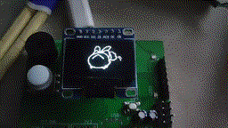
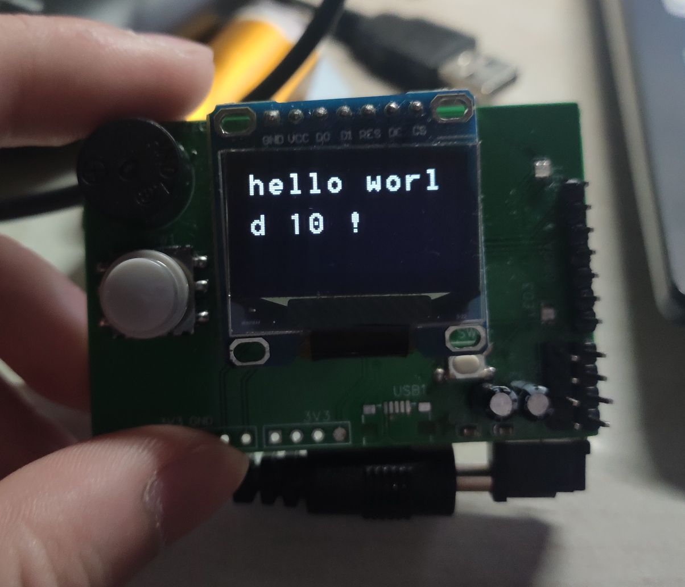
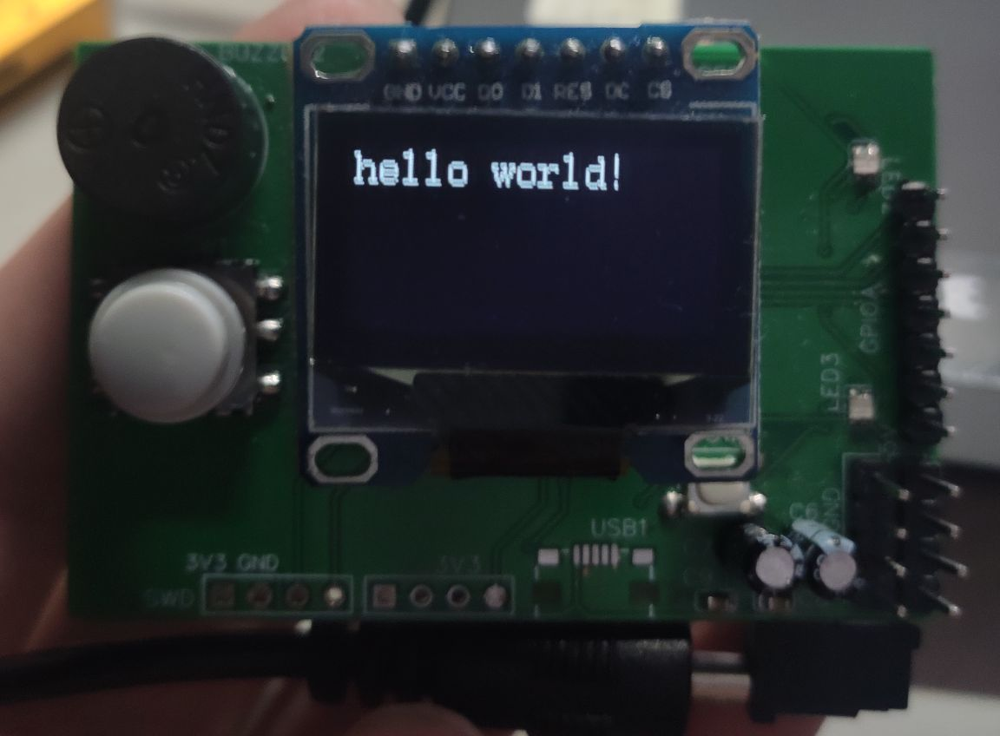

# 4线spi OLED屏幕c++库 基于mm32spin27



## 使用说明

屏幕对象在`oled.cpp`中声明。可以用以下几种方式创建对象：

1. 使用`wy_spi.hpp`中声明的初始化结构体`SoftInitStruct`或`HardInitStruct`（在命名空间SPI中）创建对象，用该方式创建的对象已经完成初始化。例如：

   1. 软件spi：

      ```c++
      RCC_AHBPeriphClockCmd(RCC_AHBPeriph_GPIOA, ENABLE);
      RCC_AHBPeriphClockCmd(RCC_AHBPeriph_GPIOB, ENABLE);
      
      SPI::SoftInitStruct oledSoft;
      
      oledSoft.CS_Pin = GPIO_Pin_5;
      oledSoft.CS_Port = GPIOA;
      oledSoft.DC_Pin = GPIO_Pin_10;
      oledSoft.DC_Port = GPIOB;
      oledSoft.MOSI_Pin = GPIO_Pin_6;
      oledSoft.MOSI_Port = GPIOA;
      oledSoft.RES_Pin = GPIO_Pin_11;
      oledSoft.RES_Port = GPIOB;
      oledSoft.SCLK_Pin = GPIO_Pin_4;
      oledSoft.SCLK_Port = GPIOA;
      
      OLED::OLED_Object screen(&oledSoft);
      ```

      

   2. 硬件spi：

      类似

2. 先创建对象，再进行屏幕初始化

```c++
OLED::OLED_Object screen;

SPI::SoftInitStruct oledSoft;

oledSoft.CS_Pin = GPIO_Pin_5;
oledSoft.CS_Port = GPIOA;
oledSoft.DC_Pin = GPIO_Pin_10;
oledSoft.DC_Port = GPIOB;
oledSoft.MOSI_Pin = GPIO_Pin_6;
oledSoft.MOSI_Port = GPIOA;
oledSoft.RES_Pin = GPIO_Pin_11;
oledSoft.RES_Port = GPIOB;
oledSoft.SCLK_Pin = GPIO_Pin_4;
oledSoft.SCLK_Port = GPIOA;

RCC_AHBPeriphClockCmd(RCC_AHBPeriph_GPIOA, ENABLE);
RCC_AHBPeriphClockCmd(RCC_AHBPeriph_GPIOB, ENABLE);

screen.reInit(&oledSoft);
```

注意，**不管用什么方式进行初始化，都必须先开启对应引脚的GPIO时钟**。

## 接口说明

对象`OLED_Object`成员列表

| 成员名                                         | 来源                           | 描述          | 公有 |
| ---------------------------------------------- | ------------------------------ | ------------- |:---:|
| `void init(HardInitStruct *h)`                 | 继承自spi基类`SPI::SPI_Object` | 初始化硬件spi | 否   |
| `void init(SoftInitStruct *s)`                 | 继承自spi基类`SPI::SPI_Object` | 初始化软件spi | 否 |
| `uint16_t DC_Pin `; `GPIO_TypeDef *DC_Port`    | 继承自spi基类`SPI::SPI_Object` | DC引脚 | 否 |
| `uint16_t RES_Pin`; `GPIO_TypeDef *RES_Port`   | 继承自spi基类`SPI::SPI_Object` | RES引脚 | 否 |
| `uint16_t CS_Pin`; `GPIO_TypeDef *CS_Port`     | 继承自spi基类`SPI::SPI_Object` | CS引脚 | 否 |
| `uint16_t SCLK_Pin`; `GPIO_TypeDef *SCLK_Port` | 继承自spi基类`SPI::SPI_Object` | SCLK引脚 | 否 |
| `uint16_t MOSI_Pin`; `GPIO_TypeDef *MOSI_Port` | 继承自spi基类`SPI::SPI_Object` | MOSI引脚 | 否 |
| `SPI_TypeDef *spi` | 继承自spi基类`SPI::SPI_Object` | SPI | 否 |
| `void sendByte(uint8_t dat)` | 继承自spi基类`SPI::SPI_Object`（重定义） | 发送8位数据 | 否 |
| `const uint8_t *font` | 继承自基类`genO::generalOutputBase` | 字体指针 | 否 |
| `uint8_t fontUnitSize` | 继承自基类`genO::generalOutputBase` | 字体指针偏移量 | 否 |
| `uint8_t asciiHigh, asciiWide` | 继承自基类`genO::generalOutputBase` | 字体大小 | 否 |
| `uint8_t maxWord, maxLine` | 继承自基类`genO::generalOutputBase` | 屏幕范围 | 否 |
| `uint8_t line` | 继承自基类`genO::generalOutputBase` | 行计数 | 否 |
| `char wordCount` | 继承自基类`genO::generalOutputBase` | 字符计数 | 否 |
| `chooseLine` | 继承自基类`genO::generalOutputBase` | 高亮行 | 是 |
| `void char_display(const uint8_t *ptr_pic, bool contrast)` | 继承自基类`genO::generalOutputBase` | 提供输出字符接口 | 否 |

懒得写了后面。。先他妈的上传了再说

## 效果演示

- 对于24*12的字体：

    ```cpp
    OLED::OLED_Object screen(&oledSoft);

    screen.loadFont(ASCII_24_12[0], 24, 12);	//装载字体
    screen.setScreenSize(128, 64);				//设置屏幕分辨率

    screen.clear();
    sprintf(screen.str, "hello world %d !", 10);
    screen.printStr();
    ```

     对应效果：
    

- 对于16*8字体：

    ```cpp
    OLED::OLED_Object screen(&oledSoft);
    
    screen.loadFont(ASCII[0], 16, 8); 	//装载字体
    screen.setScreenSize(128, 64); 		//设置屏幕分辨率
    
    screen.clear();
    screen.print("hello world!\n");
    ```

    对应效果：
    
    

- 动态图

  
